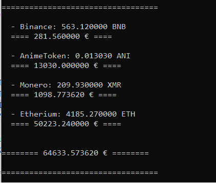

# my_crypto_balance
<p1>This is a small program I wrote for myself (without API) to know how much cryptocurrency I own in total.</p1>

<h3>Clone and Run</h3>

$ git clone https://github.com/Lawand-A/my_crypto_balance.git

$ cd my_crypto_balance

$ pip install lxml

$ pip install requests

$ pip install beautifulsoup4

$ python crypto.py

